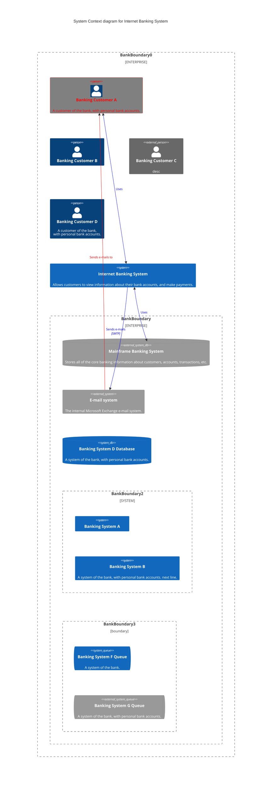
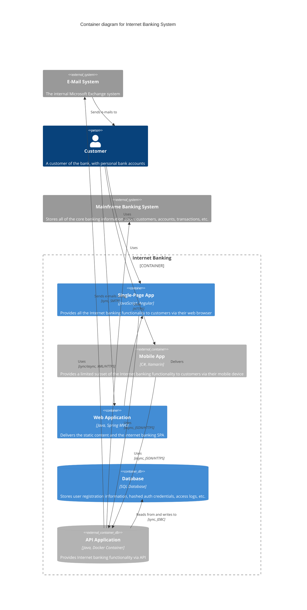
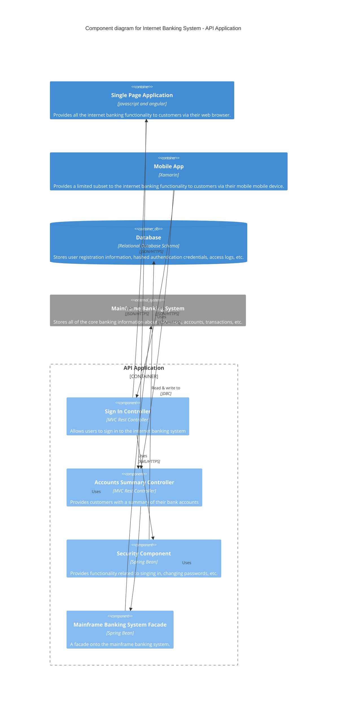
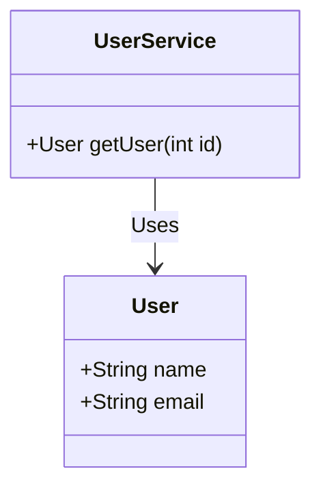

Here's a concise guide based on the C4 Architecture model:

### C4 Model for Visualizing Software Architecture

The C4 model breaks down software architecture into four hierarchical diagrams:
#### 1. System Context Diagram
- **Purpose**: Provides a high-level view of the system and its interactions.
- **Components**: Shows the system (as a central box), users, and other interacting systems.
- **Focus**: People (actors, roles, personas) and software systems, not technologies or protocols.

#### 2. Container Diagram
- **Purpose**: Illustrates high-level technology choices and the overall architecture.
- **Components**: Displays containers (e.g., web applications, databases) and their communication.
- **Focus**: Separately deployable units executing code or storing data, and their interactions.

#### 3. Component Diagram
- **Purpose**: Zooms into each container to show major building blocks and their interactions.
- **Components**: Details components, their responsibilities, and implementation details.
- **Focus**: Structural details within a container; multiple diagrams may be needed for complex containers.

#### 4. (Optional) Code/Class Diagram
- **Purpose**: Further detail components by showing class structures and code-level elements.
- **Components**: Classes, methods, properties, etc.
- **Focus**: Detailed implementation specifics.

### Additional Notes
- **Hierarchy**: The C4 model moves from high-level (System Context) to detailed (Code/Class).
- **Consistency**: Ensure consistent notation and a shared set of abstractions within the team.
- **Supplementary Diagrams**: Use additional diagrams to show runtime behavior and deployment.

### Example Usage in Obsidian
You can create sections in your Obsidian notes for each diagram level, adding diagrams and descriptions as needed. Here’s a structure you might follow:

```markdown
# C4 Architecture Model

## System Context Diagram
- Description: High-level view of the system and interactions.
- Diagram: 

## Container Diagram
- Description: High-level technology choices and architecture.
- Diagram: 

## Component Diagram
- Description: Detailed view of components within containers.
- Diagram: 

## Code/Class Diagram (Optional)
- Description: Code-level details of components.
- Diagram: 
```

### C4 Diagrams
Here’s an expanded guide on using Mermaid to create C4 Architecture diagrams, based on the official Mermaid C4 syntax documentation:

### C4 Model with Mermaid

#### System Context Diagram

- **C4Context**: Defines a system context diagram.
- **Boundary**: Groups elements within a boundary.
- **Person/System**: Defines actors and systems.
- **->**: Defines interactions.

#### Container Diagram

- **C4Container**: Defines a container diagram.
- **Container/ContainerDb**: Defines containers and databases.
- **System_Boundary**: Defines system boundaries.

#### Component Diagram

- **C4Component**: Defines a component diagram.
- **Component/ComponentDb**: Defines components and databases.
- **Container_Boundary**: Defines container boundaries.

#### Code/Class Diagram (Optional)

- **classDiagram**: Defines a class diagram.
- **class**: Defines classes and their attributes/methods.

 [Mermaid C4 syntax documentation](https://mermaid.js.org/syntax/c4.html).
### Tags
#diagram #C4 #architecture 