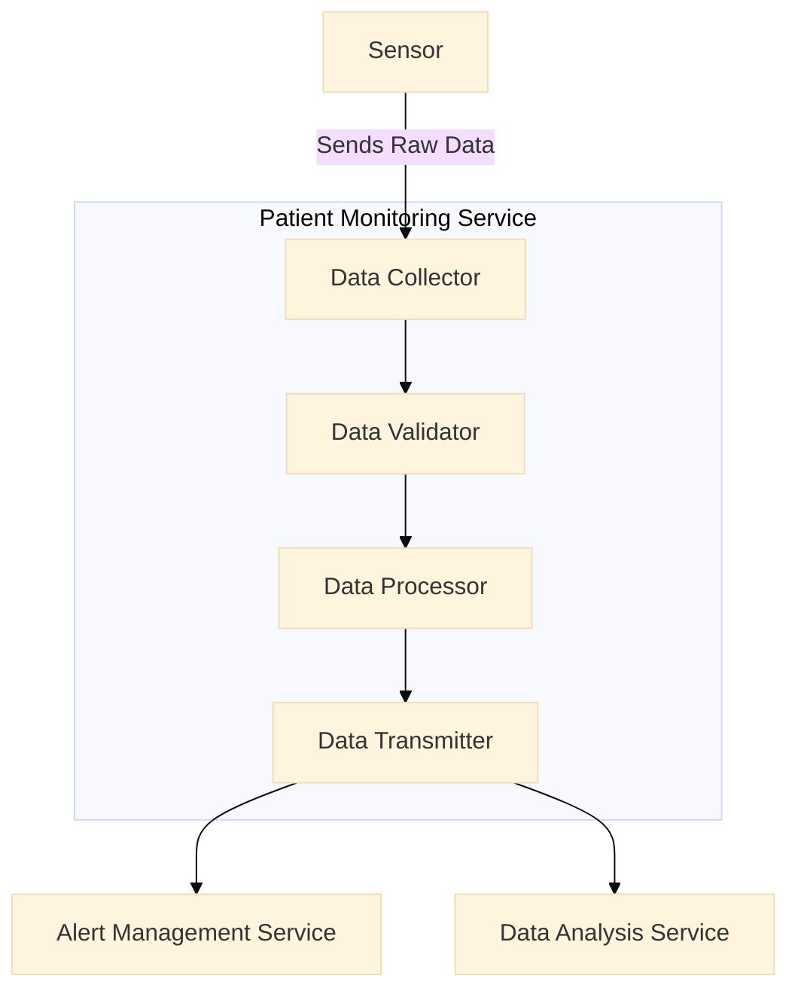

### Develop Component Diagram (C3) Cheat Sheet

#### **Purpose**
The Component Diagram (C3) provides a detailed view of the system's architecture at a lower level than the Container Diagram (C2). It shows the main components within each container, their responsibilities, and their interactions. This helps in understanding the internal structure and dependencies within each container.

#### **Structure of a Component Diagram (C3)**

1. **Title**
   - A clear, descriptive title for the diagram.

2. **Introduction**
   - Brief overview of the container and its purpose.
   - Description of the container’s internal structure.

3. **Components**
   - List and describe the main components within the container.
   - For each component, include its responsibilities and interactions with other components.

4. **Interactions**
   - Describe the interactions between the components within the container.
   - Highlight the main data flows and communication channels.

5. **Visual Representation**
   - Create a visual diagram using Mermaid or another tool.
   - Include a legend to explain the symbols and colors used in the diagram.

6. **Review and Validation**
   - Describe the process for reviewing and validating the component diagram.
   - Explain how stakeholders will be involved in the validation process.

7. **Conclusion**
   - Summarize the importance of the component diagram for understanding the system’s internal structure and interactions.
   - Outline the next steps in the architectural design process.

8. **Appendices**
   - **Glossary**: Define any specific terms used in the document.
   - **References**: Provide links or references to related documents or sources.

### Example Component Diagram (C3) with Mermaid

#### 1. Title

**Title**: Patient Monitoring Service Component Diagram (C3)

#### 2. Introduction

This document provides a detailed view of the internal structure of the Patient Monitoring Service within the MonitorMe system, illustrating the main components and their interactions.

#### 3. Components

1. **Data Collector**
   - **Responsibilities**: Collects raw data from sensors.
   - **Interactions**: Receives data from sensors, sends data to Data Validator.

2. **Data Validator**
   - **Responsibilities**: Validates the collected data to ensure it meets required standards.
   - **Interactions**: Receives data from Data Collector, sends validated data to Data Processor.

3. **Data Processor**
   - **Responsibilities**: Processes the validated data to extract meaningful information.
   - **Interactions**: Receives validated data from Data Validator, sends processed data to Data Transmitter.

4. **Data Transmitter**
   - **Responsibilities**: Transmits the processed data to other services.
   - **Interactions**: Receives processed data from Data Processor, sends data to Alert Management Service and Data Analysis Service.

#### 4. Interactions

- **Sensor** sends raw data to the **Data Collector**.
- **Data Collector** sends collected data to the **Data Validator**.
- **Data Validator** sends validated data to the **Data Processor**.
- **Data Processor** sends processed data to the **Data Transmitter**.
- **Data Transmitter** sends data to the **Alert Management Service** and **Data Analysis Service**.

#### 5. Visual Representation

Refer to the Mermaid diagram above for the visual representation of the component diagram.

#### 6. Review and Validation

- **Review Process**: The component diagram will be reviewed in collaboration with domain experts and stakeholders to ensure accuracy and completeness.
- **Stakeholder Involvement**: Stakeholders will provide feedback during review sessions to validate the interactions and responsibilities of the components.

#### 7. Conclusion

The component diagram provides a clear visual representation of the internal structure of the Patient Monitoring Service. It helps in understanding the responsibilities of different components and their interactions, facilitating effective design and implementation.

#### 8. Appendices

**Glossary**:
- **Component Diagram (C3)**: A detailed diagram that shows the main components within a container and their interactions.
- **Component**: A part of the system that has a specific responsibility and interacts with other components.

**References**:
- [[C4 Architecture Mermaid Diagram Cheat Sheet]]
- [[Event Storming]]

---

This cheat sheet provides a structured approach to developing a Component Diagram (C3), ensuring that the internal structure of the container and the interactions between components are clearly defined and understood. The use of Mermaid for visual representation helps in creating consistent and easy-to-understand diagrams.