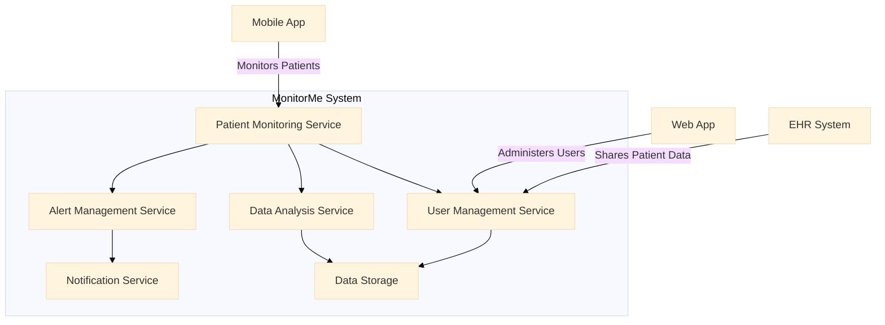

### Develop Container Diagram (C2) Cheat Sheet

#### **Purpose**
The Container Diagram (C2) provides a detailed view of the system's architecture, showing the major containers (applications, services, databases, etc.) and how they interact. It helps in understanding the internal structure of the system and the interactions between different containers.

#### **Structure of a Container Diagram (C2)**

1. **Title**
   - A clear, descriptive title for the diagram.

2. **Introduction**
   - Brief overview of the system and its purpose.
   - Description of the system’s internal structure.

3. **Containers**
   - List and describe the major containers within the system.
   - For each container, include its responsibilities and interactions with other containers.

4. **Interactions**
   - Describe the interactions between the containers.
   - Highlight the main data flows and communication channels.

5. **Visual Representation**
   - Create a visual diagram using Mermaid or another tool.
   - Include a legend to explain the symbols and colors used in the diagram.

6. **Review and Validation**
   - Describe the process for reviewing and validating the container diagram.
   - Explain how stakeholders will be involved in the validation process.

7. **Conclusion**
   - Summarize the importance of the container diagram for understanding the system’s internal structure and interactions.
   - Outline the next steps in the architectural design process.

8. **Appendices**
   - **Glossary**: Define any specific terms used in the document.
   - **References**: Provide links or references to related documents or sources.

### Example Container Diagram (C2) with Mermaid

#### 1. Title

**Title**: MonitorMe Container Diagram (C2)

#### 2. Introduction

This document provides a detailed view of the internal structure of the MonitorMe system, illustrating the major containers and their interactions.

#### 3. Containers

1. **Patient Monitoring Service**
   - **Responsibilities**: Collects and monitors patient vital signs.
   - **Interactions**: Sends data to Data Analysis Service, interacts with Alert Management Service.

2. **Alert Management Service**
   - **Responsibilities**: Manages alerts triggered by anomalies in patient data.
   - **Interactions**: Receives data from Patient Monitoring Service, sends notifications via Notification Service.

3. **Data Analysis Service**
   - **Responsibilities**: Analyzes patient data to detect anomalies and generate insights.
   - **Interactions**: Receives data from Patient Monitoring Service, stores data in Data Storage.

4. **User Management Service**
   - **Responsibilities**: Handles user authentication, authorization, and profile management.
   - **Interactions**: Interacts with Data Storage and receives data from EHR System.

5. **Notification Service**
   - **Responsibilities**: Sends notifications to users based on alerts.
   - **Interactions**: Receives alerts from Alert Management Service.

6. **Data Storage**
   - **Responsibilities**: Stores patient data, user data, and analysis results.
   - **Interactions**: Receives data from Data Analysis Service and User Management Service.

#### 4. Interactions

- **Mobile App** monitors patients through the **Patient Monitoring Service**.
- **Web App** administers users through the **User Management Service**.
- **EHR System** shares patient data with the **User Management Service**.
- **Patient Monitoring Service** sends data to **Data Analysis Service** and interacts with **Alert Management Service**.
- **Alert Management Service** sends notifications via **Notification Service**.
- **Data Analysis Service** stores data in **Data Storage**.
- **User Management Service** interacts with **Data Storage**.

#### 5. Visual Representation

Refer to the Mermaid diagram above for the visual representation of the container diagram.

#### 6. Review and Validation

- **Review Process**: The container diagram will be reviewed in collaboration with domain experts and stakeholders to ensure accuracy and completeness.
- **Stakeholder Involvement**: Stakeholders will provide feedback during review sessions to validate the interactions and responsibilities of the containers.

#### 7. Conclusion

The container diagram provides a clear visual representation of the internal structure of the MonitorMe system. It helps in understanding the responsibilities of different containers and their interactions, facilitating effective design and implementation.

#### 8. Appendices

**Glossary**:
- **Container Diagram (C2)**: A detailed diagram that shows the major containers in the system and their interactions.
- **Container**: An application, service, database, or other component within the system.

**References**:
- [[C4 Architecture Mermaid Diagram Cheat Sheet]]
- [[Event Storming]]

---

This cheat sheet provides a structured approach to developing a Container Diagram (C2), ensuring that the internal structure of the system and the interactions between containers are clearly defined and understood. The use of Mermaid for visual representation helps in creating consistent and easy-to-understand diagrams.