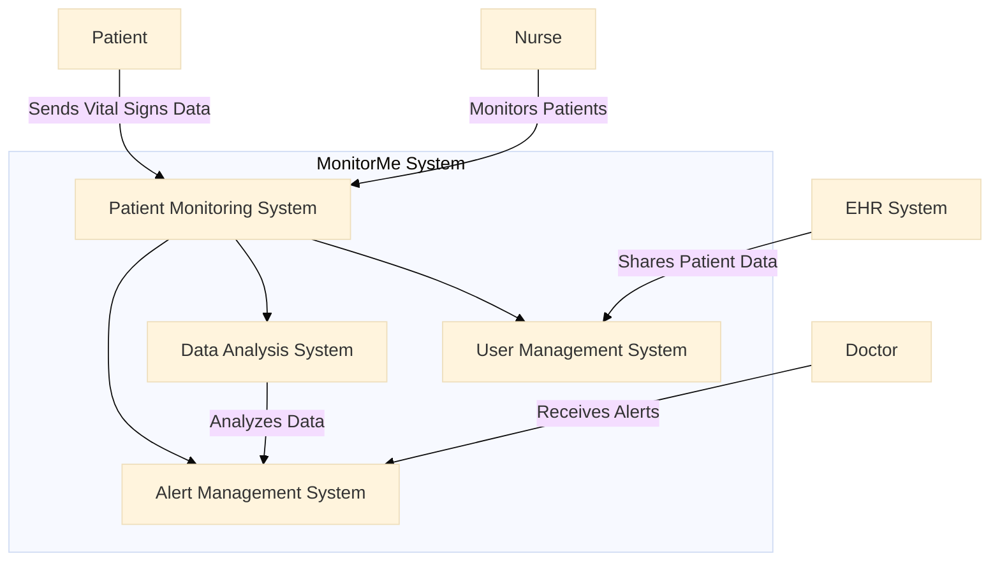

### Develop Context Diagram (C1) Cheat Sheet

#### **Purpose**
The Context Diagram (C1) is the highest-level diagram in the C4 model. It provides a broad overview of the system, showing how it interacts with external actors (such as users, systems, and external entities). The C1 diagram helps in understanding the boundaries of the system and its primary interactions.

#### **Structure of a Context Diagram (C1)**

1. **Title**
   - A clear, descriptive title for the diagram.

2. **Introduction**
   - Brief overview of the system and its purpose.
   - Description of the system’s scope and context.

3. **External Actors**
   - List and describe the external actors that interact with the system.
   - Actors can include users, external systems, and other entities.

4. **System Boundary**
   - Define the boundaries of the system.
   - Describe what is inside the system and what is outside.

5. **Interactions**
   - Describe the interactions between the system and the external actors.
   - Highlight the main data flows and communication channels.

6. **Visual Representation**
   - Create a visual diagram using Mermaid or another tool.
   - Include a legend to explain the symbols and colors used in the diagram.

7. **Review and Validation**
   - Describe the process for reviewing and validating the context diagram.
   - Explain how stakeholders will be involved in the validation process.

8. **Conclusion**
   - Summarize the importance of the context diagram for understanding the system’s boundaries and interactions.
   - Outline the next steps in the architectural design process.

9. **Appendices**
   - **Glossary**: Define any specific terms used in the document.
   - **References**: Provide links or references to related documents or sources.

### Example Context Diagram (C1) with Mermaid

#### 1. Title

**Title**: MonitorMe Context Diagram (C1)

#### 2. Introduction

This document provides a high-level overview of the MonitorMe system, illustrating its interactions with external actors and defining the system's boundaries.

#### 3. External Actors

1. **Patient**
   - **Description**: Provides vital signs data to the system.
   
2. **Doctor**
   - **Description**: Receives alerts generated by the system based on patient data.
   
3. **Nurse**
   - **Description**: Monitors patient data and ensures the system functions correctly.
   
4. **EHR System**
   - **Description**: External electronic health records system that shares patient data with MonitorMe.

#### 4. System Boundary

The MonitorMe system includes the following subsystems:
- **Patient Monitoring System**
- **Alert Management System**
- **Data Analysis System**
- **User Management System**

#### 5. Interactions

- **Patient** sends vital signs data to the **Patient Monitoring System**.
- **Doctor** receives alerts from the **Alert Management System**.
- **Nurse** interacts with the **Patient Monitoring System** to monitor patients.
- **EHR System** shares patient data with the **User Management System**.
- **Data Analysis System** analyzes data and interacts with the **Alert Management System** to generate alerts.

#### 6. Visual Representation

Refer to the Mermaid diagram above for the visual representation of the context diagram.

#### 7. Review and Validation

- **Review Process**: The context diagram will be reviewed in collaboration with domain experts and stakeholders to ensure accuracy and completeness.
- **Stakeholder Involvement**: Stakeholders will provide feedback during review sessions to validate the interactions and boundaries.

#### 8. Conclusion

The context diagram provides a clear visual representation of the MonitorMe system’s boundaries and interactions with external actors. It helps in understanding the system’s scope and primary communication channels, facilitating effective design and implementation.

#### 9. Appendices

**Glossary**:
- **Context Diagram (C1)**: A high-level diagram that shows the system's interactions with external actors.
- **External Actor**: A user, system, or entity that interacts with the system from outside its boundaries.

**References**:
- [[C4 Architecture Mermaid Diagram Cheat Sheet]]
- [[Event Storming]]

---

This cheat sheet provides a structured approach to developing a Context Diagram (C1), ensuring that the system's boundaries and interactions are clearly defined and understood. The use of Mermaid for visual representation helps in creating consistent and easy-to-understand diagrams.