Here is an updated Mermaid Diagram Cheat Sheet with standard terminology and newer diagram types:

### Mermaid Diagram Cheat Sheet

#### Flowchart
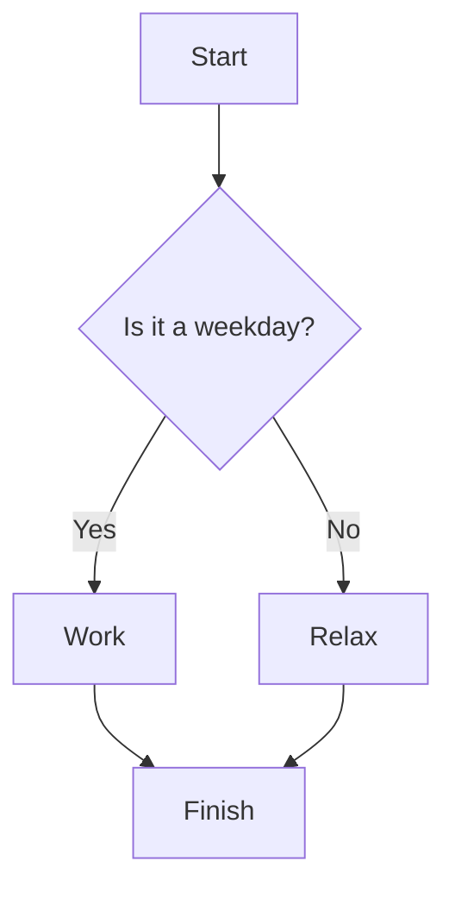
- **graph TD**: Top-down (TB, LR, RL, BT)
- **[]**: Rectangle
- **{}**: Diamond
https://mermaid.js.org/syntax/flowchart.html

#### Sequence Diagram
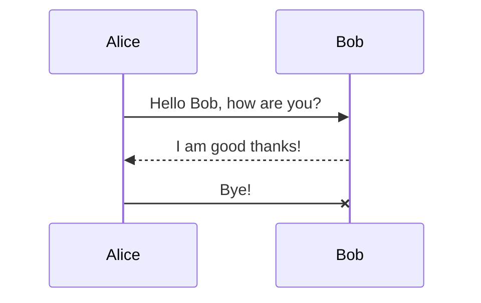
- **participant**: Define participants
- **->>**: Solid arrow
- **-->>**: Dashed arrow
- **-x**: Solid line with X
https://mermaid.js.org/syntax/sequenceDiagram.html

#### Class Diagram
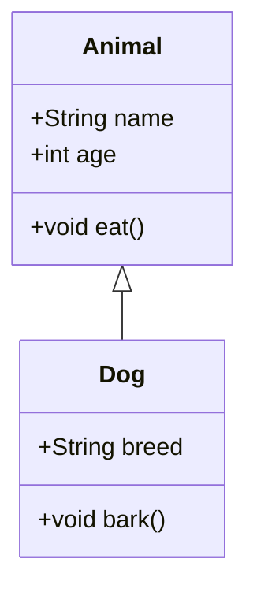
- **classDiagram**: Define class diagram
- **<|--**: Inheritance
https://mermaid.js.org/syntax/classDiagram.html

#### State Diagram
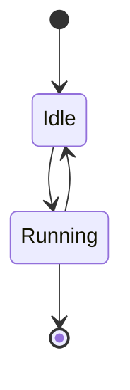
- **stateDiagram**: Define state diagram
- **[*]**: Start/End state
https://mermaid.js.org/syntax/stateDiagram.html

#### Gantt Chart
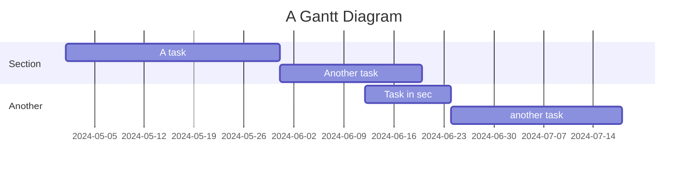
- **gantt**: Define Gantt chart
- **title**: Chart title
- **dateFormat**: Date format
- **section**: Section title
https://mermaid.js.org/syntax/gantt.html

#### Pie Chart
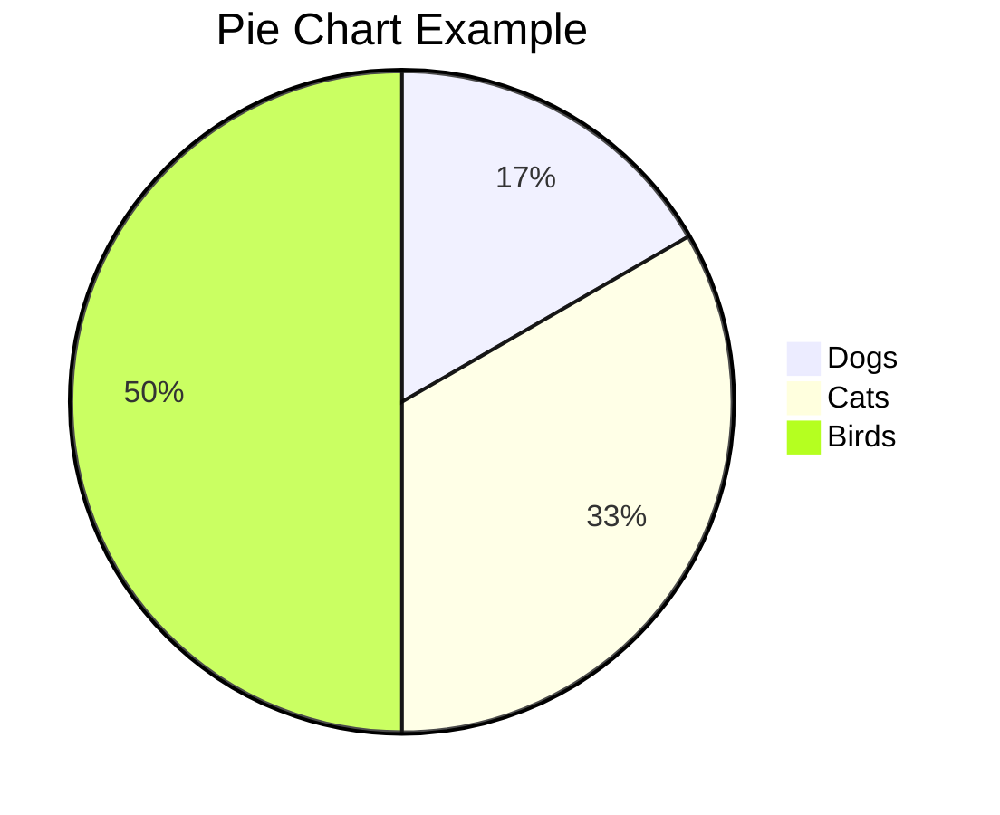
- **pie**: Define pie chart
- **title**: Chart title
https://mermaid.js.org/syntax/pie.html

#### Entity Relationship Diagram (ERD)
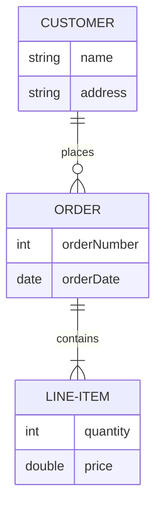
- **erDiagram**: Define ERD
- **||--o{**: One-to-many relationship
- **||--|{**: One-to-one relationship
https://mermaid.js.org/syntax/entityRelationshipDiagram.html

#### User Journey
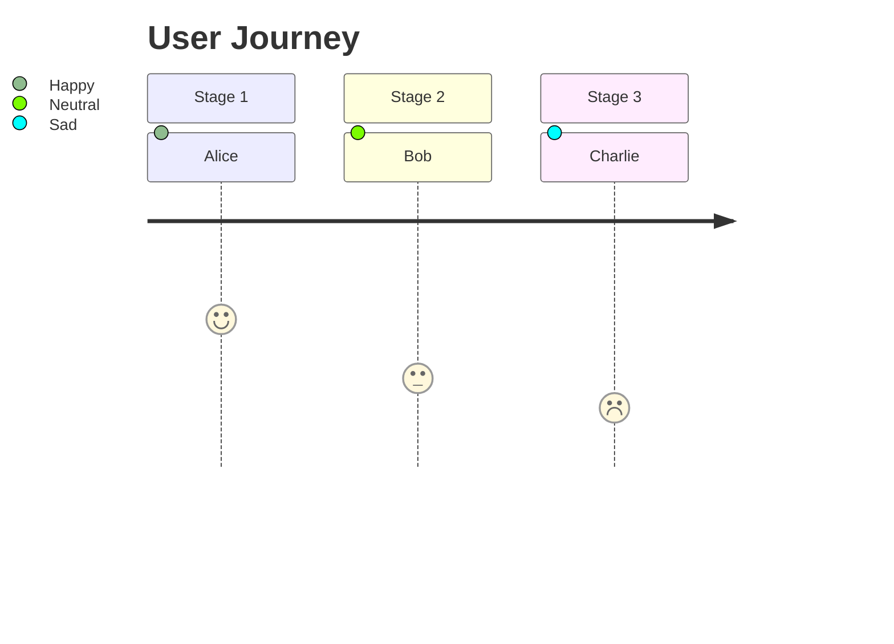
- **journey**: Define user journey
- **title**: Journey title
- **section**: Stage section
https://mermaid.js.org/syntax/userJourney.html

#### Quadrant Chart
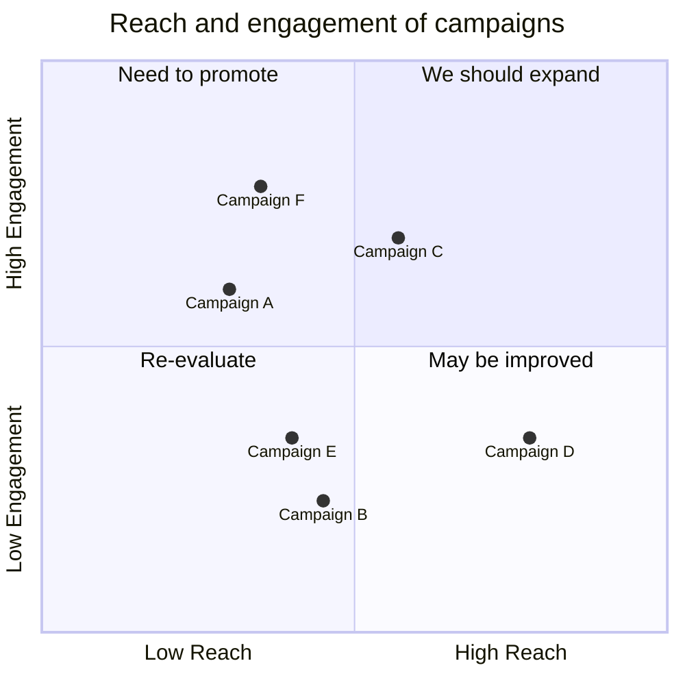
- **quadrantChart**: Define quadrant chart
- **x-axis/y-axis**: Define axis
https://mermaid.js.org/syntax/quadrantChart.html

#### Gitgraph
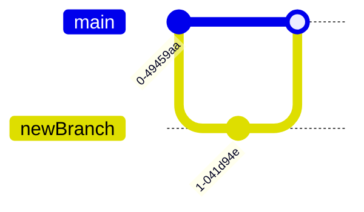
- **gitGraph**: Define Gitgraph
- **branch/commit/checkout/merge**: Git operations
https://mermaid.js.org/syntax/gitgraph.html

#### Mindmap
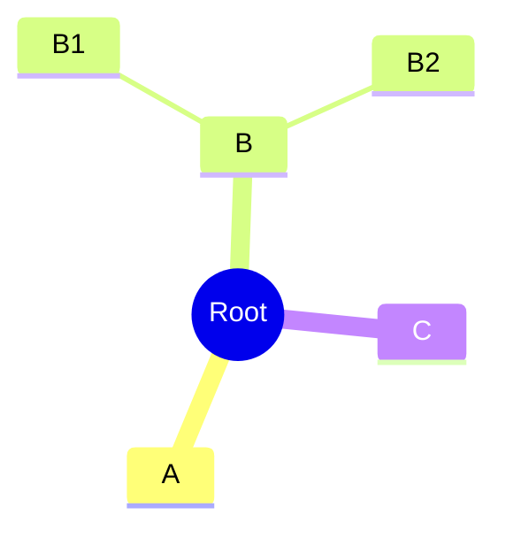
- **mindmap**: Define mindmap
- **root**: Root node
- **A, B, C**: Child nodes
https://mermaid.js.org/syntax/mindmap.html

#### Timeline
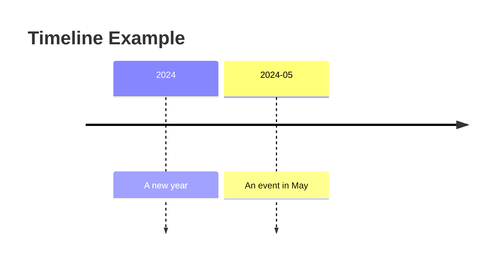
- **timeline**: Define timeline
- **title**: Timeline title
https://mermaid.js.org/syntax/timeline.html

#### Sankey Diagram
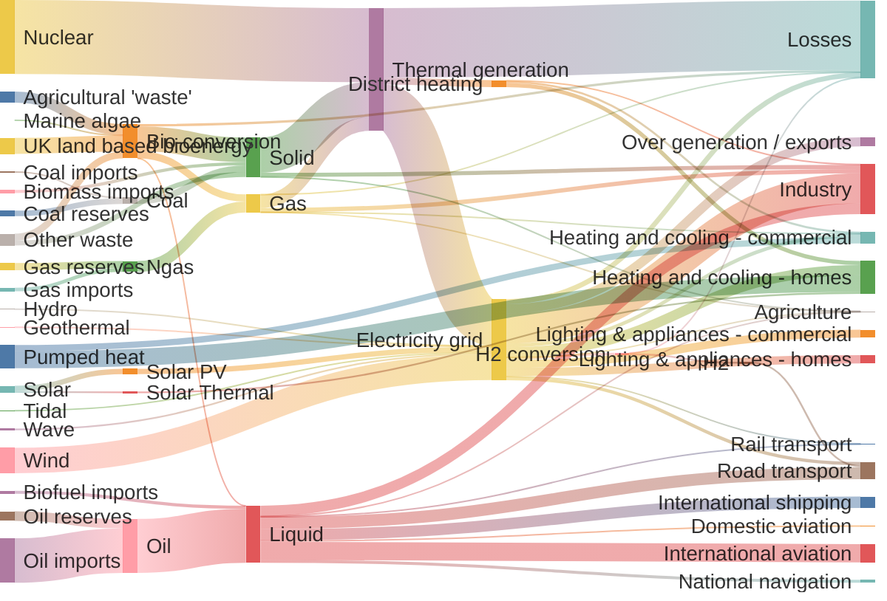
- **sankey**: Define Sankey diagram
- **== $value ==>**: Flow with value
https://mermaid.js.org/syntax/sankey.html

#### XY Chart
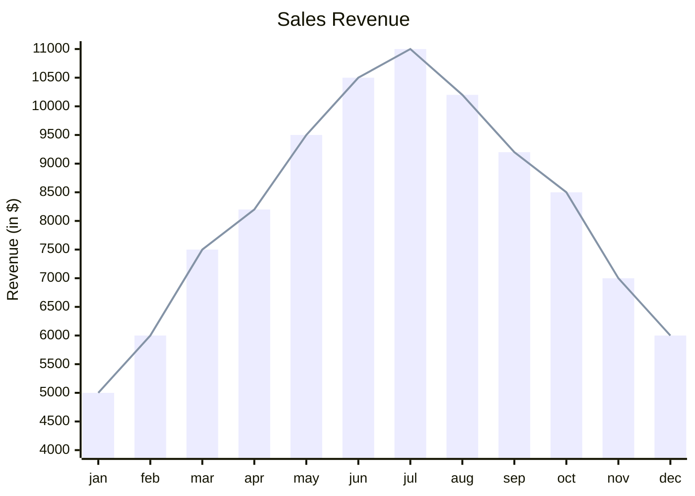
- **xyChart**: Define XY chart
- **"Series"**: Data series
https://mermaid.js.org/syntax/xyChart.html
### Tags
#diagram #mermaid #cheatsheet 