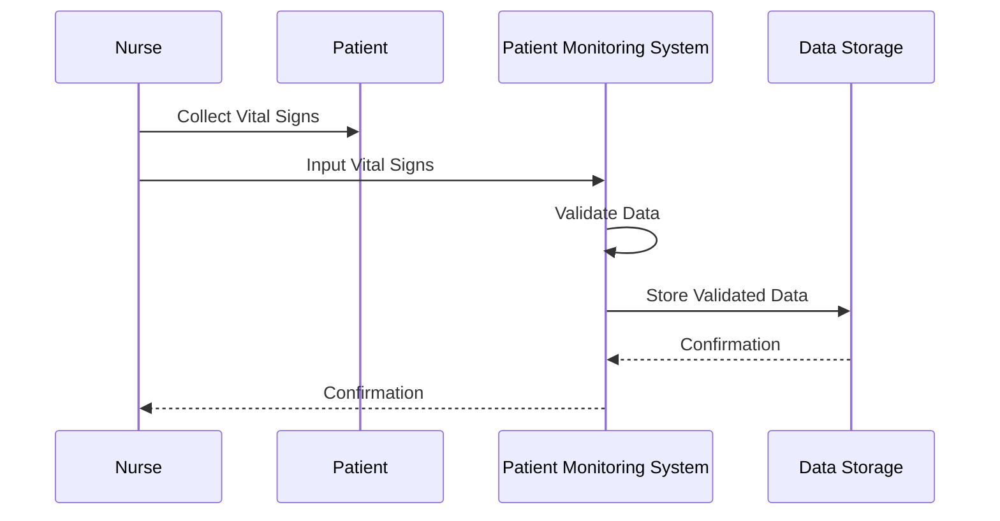

### Create Sequence Diagrams for Each Use Case Cheat Sheet

#### **Purpose**
Sequence diagrams visually represent the interactions between different objects or components in a system over time. They help in understanding the flow of messages and the sequence of operations for each use case.

#### **Structure of a Sequence Diagram Document**

1. **Title**
   - A clear, descriptive title for the sequence diagram.

2. **Introduction**
   - Brief overview of the use case being represented.
   - Description of the main interactions and purpose of the sequence diagram.

3. **Actors and Objects**
   - List and describe the actors and objects involved in the sequence.
   - For each actor/object, include its responsibilities and role in the sequence.

4. **Sequence of Interactions**
   - Describe the sequence of interactions step-by-step.
   - Highlight the messages passed between actors and objects.

5. **Visual Representation**
   - Create a sequence diagram using Mermaid or another tool.
   - Include a legend to explain the symbols and messages used in the diagram.

6. **Review and Validation**
   - Describe the process for reviewing and validating the sequence diagram.
   - Explain how stakeholders will be involved in the validation process.

7. **Conclusion**
   - Summarize the importance of the sequence diagram for understanding the use case interactions.
   - Outline the next steps in the architectural design process.

8. **Appendices**
   - **Glossary**: Define any specific terms used in the document.
   - **References**: Provide links or references to related documents or sources.

### Example Sequence Diagram with Mermaid

#### Use Case: Record Vital Signs

**Title**: Sequence Diagram for Recording Vital Signs

**Introduction**:
This sequence diagram represents the interactions involved in the "Record Vital Signs" use case, where a nurse records the vital signs of a patient into the MonitorMe system.

**Actors and Objects**:
- **Nurse**: Records the vital signs.
- **Patient**: Provides the vital signs data.
- **Patient Monitoring System**: Receives and processes the data.
- **Data Storage**: Stores the validated data.

**Sequence of Interactions**:
1. Nurse initiates the recording process.
2. Nurse collects vital signs data from the patient.
3. Nurse inputs the data into the Patient Monitoring System.
4. Patient Monitoring System validates the data.
5. Validated data is stored in the Data Storage.

#### Visual Representation

#### Review and Validation

- **Review Process**: The sequence diagram will be reviewed in collaboration with domain experts and stakeholders to ensure accuracy and completeness.
- **Stakeholder Involvement**: Stakeholders will provide feedback during review sessions to validate the interactions and sequence of operations.

#### Conclusion

The sequence diagram provides a clear visual representation of the interactions involved in recording vital signs, helping to understand the flow of messages and the sequence of operations. This facilitates effective design and implementation of the use case.

#### Appendices

**Glossary**:
- **Sequence Diagram**: A type of diagram that shows how objects interact in a particular scenario of a use case.
- **Actor**: A user or system that interacts with the use case.

**References**:
- [[C4 Architecture Mermaid Diagram Cheat Sheet]]
- [[Event Storming]]

---

This cheat sheet provides a structured approach to creating sequence diagrams for each use case, ensuring that the interactions and sequence of operations are clearly defined and understood. The use of Mermaid for visual representation helps in creating consistent and easy-to-understand diagrams.