### Identify and Document Key Use Cases Cheat Sheet

#### **Purpose**
Identifying and documenting key use cases help to define the primary functionalities and interactions of a system from the users' perspectives. Use case diagrams provide a visual representation of these interactions, making it easier to understand the system requirements and design.

#### **Structure of a Use Case Document**

1. **Title**
   - A clear, descriptive title for the use case document.

2. **Introduction**
   - Brief overview of the system and the purpose of documenting the use cases.
   - Description of the system’s scope and the users involved.

3. **Use Cases**
   - List and describe each key use case.
   - For each use case, include:
     - **Name**: The name of the use case.
     - **Actors**: The users or systems that interact with the use case.
     - **Description**: A detailed description of the use case.
     - **Preconditions**: Conditions that must be met before the use case can be initiated.
     - **Postconditions**: Conditions that must be met after the use case is completed.
     - **Main Flow**: The primary steps involved in the use case.
     - **Alternate Flows**: Any alternate paths or variations in the steps.

4. **Interactions**
   - Describe how the use cases interact with each other.
   - Highlight any dependencies or relationships between use cases.

5. **Visual Representation**
   - Create a use case diagram using Mermaid or another tool.
   - Include a legend to explain the symbols and colors used in the diagram.

6. **Review and Validation**
   - Describe the process for reviewing and validating the use cases.
   - Explain how stakeholders will be involved in the validation process.

7. **Conclusion**
   - Summarize the importance of the use cases for understanding the system’s functionalities and interactions.
   - Outline the next steps in the architectural design process.

8. **Appendices**
   - **Glossary**: Define any specific terms used in the document.
   - **References**: Provide links or references to related documents or sources.

### Example Use Case Document with Use Case Diagram (Mermaid)

---

**Title**: MonitorMe Key Use Cases

**Introduction**:
This document provides an overview of the key use cases for the MonitorMe system, illustrating the primary functionalities and interactions from the users' perspectives.

#### Use Cases

1. **Record Vital Signs**
   - **Actors**: Patient, Nurse
   - **Description**: Allows the recording of patient vital signs.
   - **Preconditions**: Patient is registered in the system.
   - **Postconditions**: Vital signs are recorded and stored in the system.
   - **Main Flow**:
     1. Nurse selects the patient.
     2. Nurse records the vital signs.
     3. System validates and stores the data.
   - **Alternate Flows**:
     - If validation fails, an error message is displayed.

2. **Analyze Data**
   - **Actors**: Data Analyst, System
   - **Description**: Analyzes recorded data to detect anomalies.
   - **Preconditions**: Data must be recorded in the system.
   - **Postconditions**: Analysis results are stored and alerts are generated if necessary.
   - **Main Flow**:
     1. System retrieves recorded data.
     2. System analyzes data for anomalies.
     3. System stores analysis results.
     4. System generates alerts if anomalies are detected.

3. **Send Alert**
   - **Actors**: System, Doctor
   - **Description**: Sends an alert to the doctor if an anomaly is detected.
   - **Preconditions**: Anomaly is detected in the data.
   - **Postconditions**: Doctor is notified of the anomaly.
   - **Main Flow**:
     1. System detects an anomaly.
     2. System generates an alert.
     3. System sends the alert to the doctor.
     4. Doctor acknowledges the alert.

#### Interactions

- **Record Vital Signs** interacts with **Analyze Data** by providing the data that needs to be analyzed.
- **Analyze Data** interacts with **Send Alert** by triggering the alert when an anomaly is detected.

#### Visual Representation

```mermaid
flowchart TB
    subgraph "MonitorMe System"
    uc1((Record Vital Signs))
    uc2((Analyze Data))
    uc3((Send Alert))
    end

    patient[Patient👤]
    nurse[Nurse👤]
    data_analyst[Data Analyst👤]
    doctor[Doctor👤]

    patient --> uc1
    nurse --> uc1
    uc1 --> uc2
    data_analyst --> uc2
    uc2 --> uc3
    doctor --> uc3
```

#### Review and Validation

- **Review Process**: The use cases will be reviewed in collaboration with domain experts and stakeholders to ensure accuracy and completeness.
- **Stakeholder Involvement**: Stakeholders will provide feedback during review sessions to validate the use cases and their interactions.

#### Conclusion

The use case document provides a clear and structured approach to understanding the MonitorMe system’s functionalities and interactions from the users' perspectives. By documenting key use cases, we ensure that the system meets user needs and requirements.

#### Appendices

**Glossary**:
- **Use Case**: A description of a system’s behavior as it responds to a request from an external actor.
- **Actor**: A user, system, or entity that interacts with the system.

**References**:
- [[C4 Architecture Mermaid Diagram Cheat Sheet]]]
- [[Event Storming]]

---

This cheat sheet provides a comprehensive guide to identifying and documenting key use cases, ensuring that the system’s functionalities and interactions are clearly defined and understood. The use of Mermaid for visual representation helps in creating consistent and easy-to-understand diagrams.